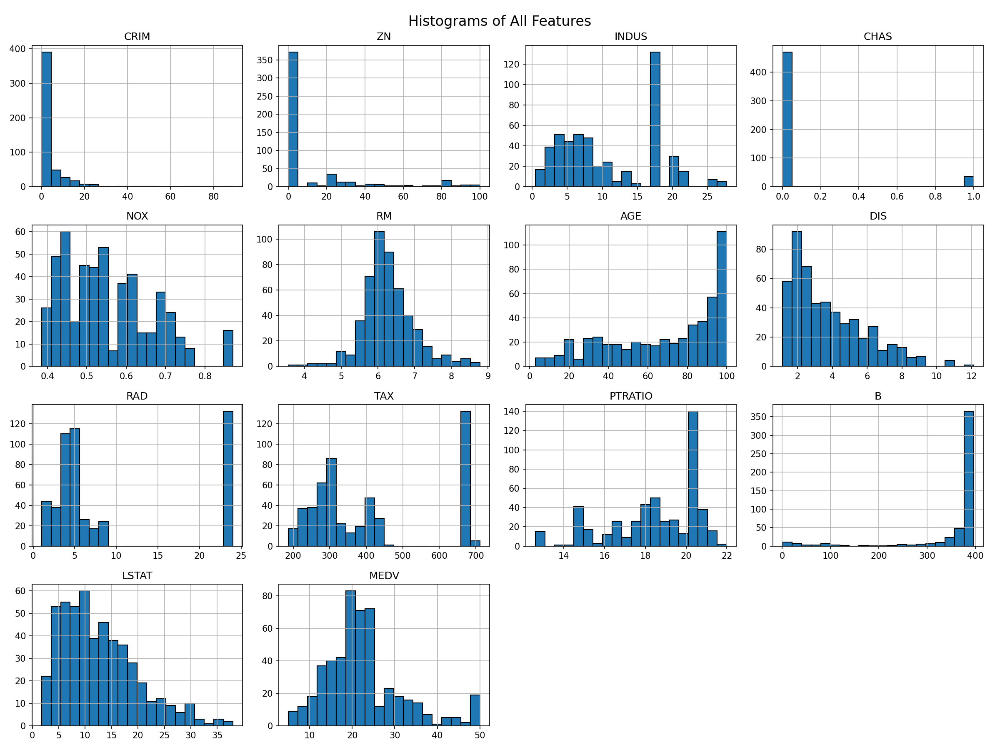

<h1 align="center" style="font-family: 'Times New Roman', Times, serif; font-size: 48px;">DATA ANALYTICS PORTFOLIO</h1>

  

  
  &nbsp;&nbsp;&nbsp;
  
  &nbsp;&nbsp;&nbsp;
  

---

## About

Data analyst turning raw numbers into clear, actionable insights from Python pipelines to interactive dashboards and predictive models. This portfolio is a snapshot of that work, ranging from foundational EDA to machine learning and NLP.

---

## Tools

  
  
  
  
  

---

 This dashboard provides a consolidated view of customer shopping behavior across product categories, demographics, subscription status, and shipping preferences. It is built to help stakeholders quickly identify revenue drivers, customer segments, and category performance trends. ## Data Source | Attribute       | Detail                                  ||-----------------|------------------------------------------|| File            | `customer_shopping_behavior.csv`         || Records         | 3,900 customer transactions              || Grain           | One row per transaction                  || Table name      | `customer_shopping_behavior`             | 
  
 The screenshot above shows the report filtered to **male, subscribed customers** — a segment of 1,053 customers (roughly 27% of the full 3,900-customer base) generating $62.65K in revenue. This filtered view is a useful example of how the slicers let stakeholders drill from the full population down to a specific, actionable segment. Key observations from this segment: - **Average order value holds steady**: at $59.49, this segment's AOV is almost identical to the overall average of $59.76 — male subscribers aren't spending meaningfully more or less per order than the base population, so subscription revenue here is being driven by volume and retention rather than basket size.- **100% subscription concentration confirms the filter is working as intended**: the donut chart correctly shows all customers in this view as subscribers, validating that the Subscription Status and Gender slicers are filtering the whole page consistently.- **Category ranking is unchanged from the full dataset**: Clothing still leads both *Revenue by Category* and *Sales by Category*, followed by Accessories, Footwear, and Outerwear — this segment's category preferences mirror the overall customer base rather than diverging from it.- **Payment method mix shifts slightly**: Debit Card now leads usage, followed by PayPal, Credit Card, and Venmo — a different order and an additional method (Venmo) compared to the unfiltered view, suggesting payment preference may vary somewhat by demographic segment and is worth a closer look.- **Seasonality pattern is consistent**: Fall and Summer remain the strongest purchase periods for this segment, mirroring the overall seasonal trend. This filtered example illustrates the dashboard's core value: category and seasonal patterns are broadly stable across segments, while payment method preference shows some segment-level variation — a useful thread for further investigation (e.g. comparing payment mix across all four gender/subscription combinations).

  <a href="https://github.com/Logic-m/customer-behavior-power-bi">View Full Report →</a>
---
---
 
### Project Title 2
 
# Project Title 2

<table>
<tr>
<td width="50%">
  
</td>
<td width="50%">

Data analyst turning raw numbers into clear, actionable insights — from Python pipelines to interactive dashboards and predictive models. This project is a snapshot of that work, ranging from foundational EDA to machine learning and NLP.

[View Full Report →](https://github.com/Logic-m/customer-behavior-power-bi)

</td>
</tr>
</table>
---
 
### Project Title 3
 

  

  <a href="https://github.com/your-username/your-repo-3">View Full Report →</a>

## Contact

Feel free to reach out via [LinkedIn]([#](https://www.linkedin.com/in/mosimanegape-majasi-272165296/)), [Email](mailto:mosimanegapemj23@gmail.com), or [GitHub](https://github.com/Logic-m) to connect or discuss data analytics work.

---

*This README serves as a text-based summary of the full visual portfolio site.*
