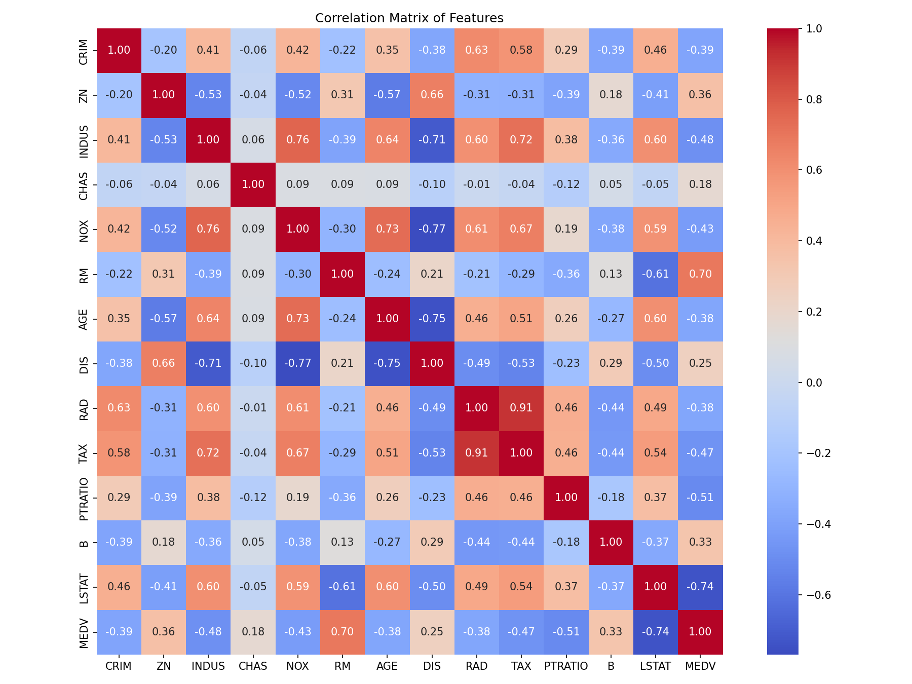
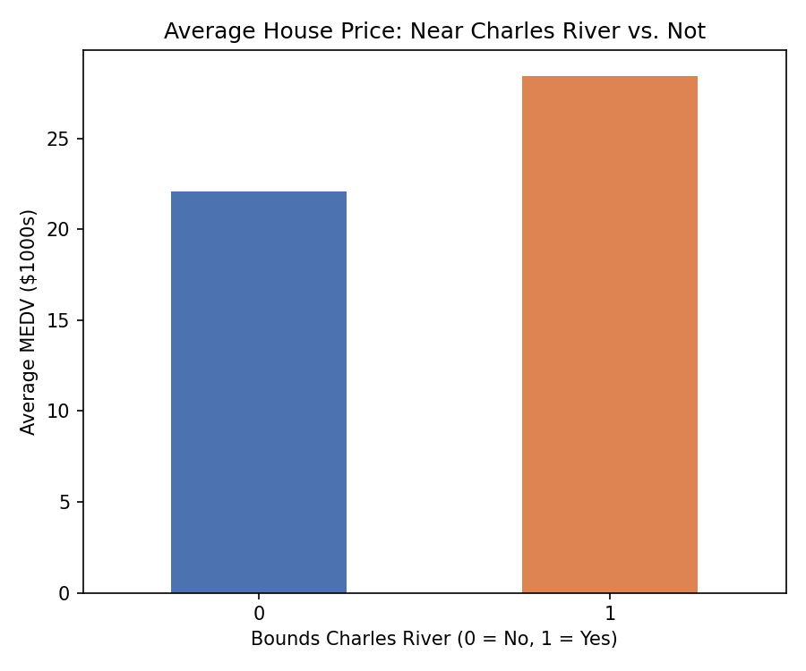
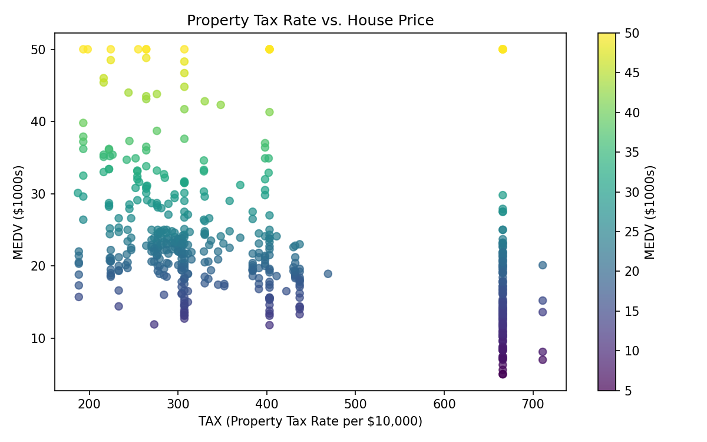

# 👋 Data Analytics Portfolio

Welcome — this repository is a curated showcase of my data analytics work, spanning **Business Intelligence dashboards (Power BI)** and **exploratory data analysis / Python data science**. Each project below links to its own repository with full code, data, and documentation.

---

## 🧰 Skills & Tools

`Power BI` · `DAX` · `Python` · `pandas` · `matplotlib` · `seaborn` · `Exploratory Data Analysis` · `Data Cleaning` · `Data Visualization` · `Statistical Correlation Analysis`

---

## 📊 Project 1 — Customer Shopping Behavior Dashboard

**Power BI | Retail Analytics | Customer Segmentation**

An interactive Power BI dashboard analyzing **3,900 retail transactions** to uncover revenue drivers, customer segments, and category performance trends. Built for stakeholders who need to move from a full customer base to an actionable, filtered segment in a few clicks.


*Dashboard filtered to male, subscribed customers — 1,053 customers generating $62.65K in revenue.*

**What it does:**
- Consolidates purchasing patterns across **product category, demographics, subscription status, and shipping preferences**
- KPI cards for **Total Revenue, Total Customers, and Average Order Value**
- Category performance via clustered column charts (revenue *and* transaction volume)
- Payment method and seasonal breakdowns via bar charts
- Four cross-filtering slicers: **Gender, Category, Subscription Status, Shipping Type**

**Key insight from the segment analysis:**
Filtering to male + subscribed customers reveals that **AOV stays flat** ($59.49 vs. $59.76 overall) — meaning subscription revenue is driven by *volume and retention*, not bigger baskets. Category rankings (Clothing → Accessories → Footwear → Outerwear) and seasonality (Fall/Summer strongest) stay consistent across segments, but **payment method mix shifts** — a thread worth digging into further.

**DAX highlights:**
```DAX
Total Revenue = SUM(customer_shopping_behavior[Purchase Amount (USD)])
Average Order Value = DIVIDE([Total Revenue], [Total Transactions])
Revenue per Customer = DIVIDE([Total Revenue], [Total Customers])
```
Plus supporting measures for discount/promo impact, loyalty & repeat-purchase behavior, satisfaction scoring, and demographic breakdowns.

**Planned next steps:** a Loyalty & Satisfaction page, a geographic revenue view, calendar-ordered seasonality, and expanded slicers (Payment Method, Discount Applied).

🔗 **[View full project & .pbix file →](https://github.com/Logic-m/customer-behavior-power-bi)**

---

## 🏘️ Project 2 — Boston Housing: EDA & Data Visualization

**Python | pandas · matplotlib · seaborn | Codveda Data Analytics Internship**

A full exploratory data analysis of the classic **Boston Housing dataset**, covering data cleaning, statistical exploration, and visual storytelling to identify what actually drives median home value (`MEDV`).

### Data Cleaning
Loaded the raw dataset, handled missing values, removed duplicates, and standardized formats → produced `cleaned_house_data.csv`.

### Exploratory Data Analysis

| | |
|---|---|
|  |  |
| Feature distributions — most are right-skewed (CRIM, LSTAT); RM and MEDV are near-normal | Median home value clusters around $21–22K, with high-value outliers above $37K |



**Strongest correlations with house price (MEDV):**

| Feature | Correlation | Interpretation |
|---------|:---:|---|
| `RM` (rooms) | **+0.70** | More rooms → higher price |
| `LSTAT` (% lower status) | **−0.74** | Higher % lower-status population → lower price |
| `PTRATIO` | −0.51 | Higher pupil-teacher ratio → lower price |
| `INDUS` | −0.48 | More industrial land → lower price |
| `TAX` | −0.47 | Higher tax rate → lower price |
| `NOX` | −0.43 | More pollution → lower price |


*Clear positive linear relationship between room count and home value.*

### Visualization Deep Dives

- **Charles River proximity:** Homes bounding the river average **~$28K** vs. **~$22K** for those that don't. 
- **Property tax vs. price:** A dense cluster of high-tax properties (TAX ≈ 666) spans a wide, often lower, price range. 
- **Socioeconomic trend:** House prices fall sharply as the % lower-status population rises. 

**Key takeaways:** Room count and neighborhood socioeconomic status are the strongest predictors of price; river-adjacent location adds a premium; crime, tax, industrial density, and pupil-teacher ratio all correlate with lower values. The cleaned dataset is ready for predictive modeling (regression) in later project stages.

🔗 **[View full project & notebooks →](https://github.com/Logic-m/stock-Analytics)**

---

## 📬 Get in Touch

If any of these projects are relevant to a role or collaboration you have in mind, feel free to reach out via GitHub or check the individual repositories above for more detail, code, and datasets.

---

> **Note on images:** the screenshots and charts referenced above (`Screenshot 2026-08-12 172008.png`, `eda_histograms.png`, `eda_boxplot_medv.png`, `eda_correlation_heatmap.png`, `eda_scatter_rm_medv.png`, `viz_barplot_chas_medv.png`, `viz_scatter_tax_medv.png`, `viz_linechart_lstat_medv.png`) should live in this repository's root (or an `/images` folder with updated paths) so they render correctly on GitHub.
